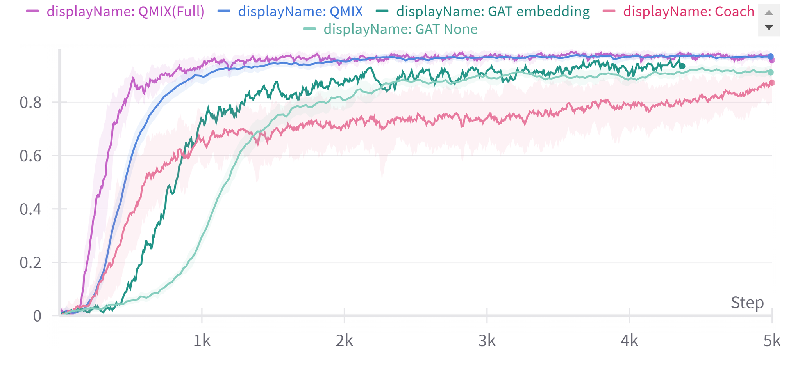

# GATCoach

Source Code for Graph Attention Network with Coach-Player Multi-Agent Reinforcement Learning, a final project for Deep Reinforcement Learning 2024 in NTHU.

This repository is fine-tuned for StarCraft Multi-agent Challenge (SMAC).

**StarCraft 2 version: SC2.4.10. difficulty: 7.**


## GAT 
* Disassemble the full view state and generate the fullt-connected graph, where each node are entities
* process the GATv2 to get the embedding weight, and mutiply with the strategy embeddings
* pass the calculated mixed strategy to coach 
## Coach
* Derive from [COPA](https://github.com/Cranial-XIX/marl-copa)
* Remove the attention layer in agents
* Use the output of the GAT as the input of coach

## Evaluation

### 3s vs 5z

### 5m vs 6m

### 8m vs 9m



## Conclusion
* Full observable baseline is too strong​
* GAT-base methods have the potential to catch up with it.​
* In the environment with more agents, coach-base methods did not perform well​
* There are still many areas worth exploring
* 
## Installation instructions
Install Python packages

```shell

# require Anaconda 3 or Miniconda 3

conda create-n pymarl python=3.8-y

conda activate pymarl


bash install_dependecies.sh

```

Set up StarCraft II (2.4.10) and SMAC:

```shell

bash install_sc2.sh

```

This will download SC2.4.10 into the 3rdparty folder and copy the maps necessary to run over.

## Command Line Tool

**Run an experiment**

```shell

# For SMAC

python3 src/main.py --config=qmix --env-config=sc2 with env_args.map_name=5m vs 6m //baseline
python3 src/main.py --config=qmix --env-config=sc2 with env_args.map_name=5m vs 6m with env_args.obs_fully_observable= true //fully observable 
baseline
python3 src/main.py --config=qmix_coach --env-config=sc2 with env_args.map_name=5m vs 6m //coach
python3 src/main.py --config=qmix_coach_embedding --env-config=sc2 with env_args.map_name=5m vs 6m //gat coach embedding

```

The config files act as defaults for an algorithm or environment.

They are all located in `src/config`.

`--config` refers to the config files in `src/config/algs`

`--env-config` refers to the config files in `src/config/envs`

**Run n parallel experiments**

```shell

# bash run.sh config_name env_config_name map_name_list (arg_list threads_num gpu_list experinments_num)

bash run.sh qmix sc2 6h_vs_8z epsilon_anneal_time=500000,td_lambda=0.3205

```

`xxx_list` is separated by `,`.

All results will be stored in the `Results` folder and named with `map_name`.

**Kill all training processes**

```shell

# all python and game processes of current user will quit.

bashclean.sh

```

```

```
